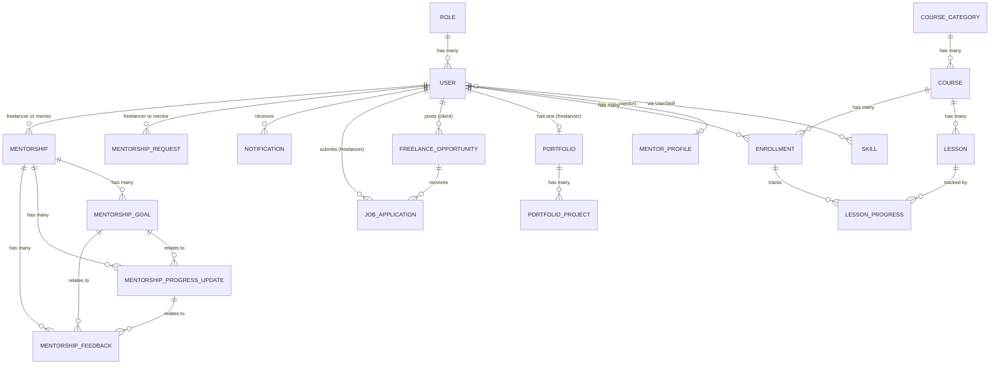

# Architecture and Data Model Summary

Generated from the actual source (`app/__init__.py`, `app/extensions.py`,
`app/models/__init__.py`, `requirements.txt`) for use as dissertation context.
Paste this into ChatGPT for Chapters Three/Four (Methodology, Analysis and
Design).

## Technology stack (approved, per AGENTS.md)

- **Backend:** Python, Flask (application factory pattern)
- **Templating:** Jinja2, HTML5, Tailwind CSS, vanilla JavaScript (no frontend framework)
- **ORM/Database:** Flask-SQLAlchemy / SQLAlchemy, SQLite (prototype; portable to PostgreSQL)
- **Auth:** Flask-Login (server-rendered session authentication, not JWT)
- **Forms/CSRF:** Flask-WTF / WTForms
- **Migrations:** Flask-Migrate / Alembic
- **Testing:** pytest
- **AI/NLP (scoped addition, see SCOPE_AMENDMENTS.md):** scikit-learn (TF-IDF + cosine similarity), fully offline, no external API

## Architectural style

Modular monolith using Flask Blueprints — one Blueprint per domain area,
each with its own `routes.py` and (where needed) `forms.py`. Three logical
layers: presentation (Jinja2 templates), application/business logic (Flask
routes + small service modules), data access (SQLAlchemy models). No
microservices, no separate API layer — server-rendered pages throughout.

```
Browser → Jinja2/HTML/Tailwind/JavaScript → Flask Blueprint Routes → (service modules) → SQLAlchemy ORM → SQLite
```

### Blueprints (registered in `app/__init__.py`)
`main`, `auth`, `users`, `courses`, `portfolio`, `opportunities`,
`mentorship`, `notifications`, `admin`, `applications` — registered in that
order via `register_blueprints(app)`.

### Service-module pattern
Cross-cutting logic that isn't tied to one HTTP route lives in plain-function
modules, not classes, imported directly into route handlers:
- `app/notifications/service.py` — `notify(user_id, message, notification_type=None)`
- `app/matching/service.py` — `recommend_opportunities_for_user`, `suggest_skills_for_text`, `compute_application_match` (the AI/NLP module — offline TF-IDF/cosine similarity + keyword matching, no persisted model, no new tables)

### Role-based access control
Four roles: `freelancer`, `mentor`, `client`, `administrator`. Enforced
server-side via a `@roles_required(...)` decorator (`app/auth/decorators.py`)
on view functions — never via hidden fields or client-side checks, per
`AGENTS.md`.

## Entity-Relationship Model

Derived from `app/models/__init__.py`. Mermaid ER diagram (paste directly
into any Mermaid-compatible renderer, or give the block to ChatGPT as
structured input):



### Entities and key fields

| Entity | Key fields | Notes |
|---|---|---|
| Role | id, name (unique) | `freelancer`, `mentor`, `client`, `administrator` |
| User | id, full_name, email (unique), password_hash, role_id FK, phone, location, bio, profile_image, is_active, created_at | `set_password`/`check_password` via Werkzeug hashing |
| Skill | id, name (unique), description | Controlled vocabulary, short labels |
| UserSkill | id, user_id FK, skill_id FK, proficiency_level | Unique(user_id, skill_id) — many-to-many join |
| MentorProfile | id, user_id FK (unique), professional_title, expertise, experience, availability | 1:1 with a mentor User |
| CourseCategory | id, name (unique), description | |
| Course | id, category_id FK, title, description, difficulty_level, image, is_published, created_at | |
| Lesson | id, course_id FK, title, content, video_url, lesson_order | Unique(course_id, lesson_order) |
| Enrollment | id, user_id FK, course_id FK, enrolled_at, completion_status | Unique(user_id, course_id); `progress_percentage` computed property |
| LessonProgress | id, enrollment_id FK, lesson_id FK, completed, completed_at | Unique(enrollment_id, lesson_id) |
| Portfolio | id, user_id FK (unique), title, description | 1:1 with a freelancer User |
| PortfolioProject | id, portfolio_id FK, title, description, project_image, project_url, completion_date | |
| FreelanceOpportunity | id, client_id FK, title, description, category, budget, deadline, status, created_at | `effective_status`/`accepts_applications` computed properties (handles expiry) |
| JobApplication | id, opportunity_id FK, freelancer_id FK, cover_message, proposed_amount, status, submitted_at | Unique(opportunity_id, freelancer_id) |
| MentorshipRequest | id, freelancer_id FK, mentor_id FK, message, status, requested_at | |
| Mentorship | id, freelancer_id FK, mentor_id FK, start_date, status | Active mentorship relationship |
| MentorshipGoal | id, mentorship_id FK, title, description, status, created_at, updated_at, completed_at | |
| MentorshipProgressUpdate | id, mentorship_id FK, author_id FK, goal_id FK (optional), content, created_at, updated_at | |
| MentorshipFeedback | id, mentorship_id FK, mentor_id FK, progress_update_id FK (optional), goal_id FK (optional), content, created_at | |
| Notification | id, user_id FK, message, notification_type, is_read, created_at | |

## Security measures implemented (per AGENTS.md rules)

- Server-side role/ownership checks on every protected route (never trusting hidden fields or client-side state)
- CSRF protection on all state-changing forms (Flask-WTF)
- Passwords hashed with Werkzeug, never stored plain
- Public registration cannot create administrator accounts
- File upload allowlisting + image re-encoding for profile/project images
- Content-Security-Policy headers restricting inline scripts (`script-src 'self'`) — all interactive JS uses `data-*` attribute hooks in `app/static/js/app.js`, never inline handlers

## Test coverage

167 automated tests (pytest) across auth, profiles, portfolio, opportunities,
applications, mentorship, mentorship workspace, admin/notifications,
learning/courses, design system, hardening, and the new AI matching module
— all passing as of the last full run. Run with `pytest` from the project
root (activate the `.venv` first).
